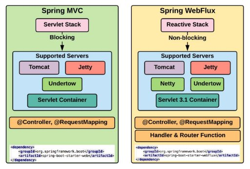
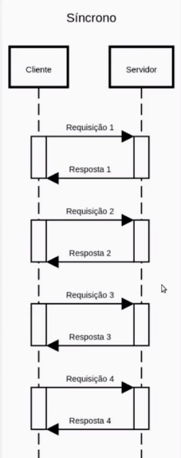
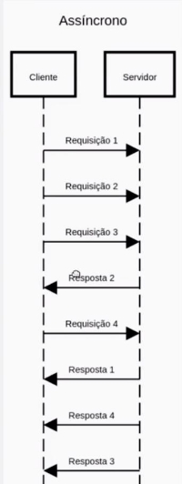

spring web flux:

\* as requisições não são bloqueantes, e se trata de programação paralela ou reativa

Ok, só que uma API comum em spring sincrona não é bloqueante… Pois cada request vai ser processada individualmente, entao **pq dizem que programação síncrona é bloqueante? E que problema o spring web flux e a programação reativa resolve?**

observe a imagem acima

é uma API sincrona, essa api faz 4 requisições para 4 servidores diferentes, e essas requisições nao dependem umas das outras… o servidor vai fazer uma requisicao, esperar responder para fazer outra, e outra… fazendo requisicao e esperando, isso é bloqueante, por isso a programação síncrona é bloqueante.

a programação reativa resolve esse problema dessa forma:

enviando todas de uma vez, recebendo e processando… programação paralela, totalmente assincrona…

vamos supor que vc faça 2 requisicoes, e que uma dure 3 segundos, e a outra dure 5 segundos em uma api sincrona, o processamento demoraria 8 segundos, em uma api assincrona demoraria apenas 5 segundos

Enquanto uma requisição é feita, a outra já está sendo enviada, mesmo sem a resposta da primeira, sem bloquear o processador. Essa é a ideia por trás da programação assíncrona

Obs: programação paralela é vc com 1 classe Main startar 3 threads para rodarem paralelamente fazendo coisas diferentes, e programação assincrona seria aquela ideia de apertar 1 botao na tela e nao ter q ficar esperando a resposta, vai executar por baixo dos panos e me avisar quando foi concluido, tipo mensageria, enfileiramento, jobs, execução em segundo plano sem prender o usuario, só q no caso da programação reativa essas 2 coisas se combinam

programação reativa é ir reagindo conforme as respostas vao chegando, lidar com fluxos de dados conforme forem chegando, ou seja, executar codigos quando a gente receber essas mensagens, reagir a esses eventos,

meu melhor exemplo de programação paralela: https://github.com/DeveloperArthur/golang-first-api-rest/blob/main/service/calcula_folha_pagamento.go

quarkus:

container first, ou seja, feito para apps q vao rodar em container

surgiu como uma solução quando começaram a querer rodar java em container, isso dava uns problemas

na hora q gera o projeto, ja vem junto o dockerfile com instrucoes de como buildar a imagem e criar o container

o tempo de boot dos sistemas é mto mais rapido e consome menos memoria
