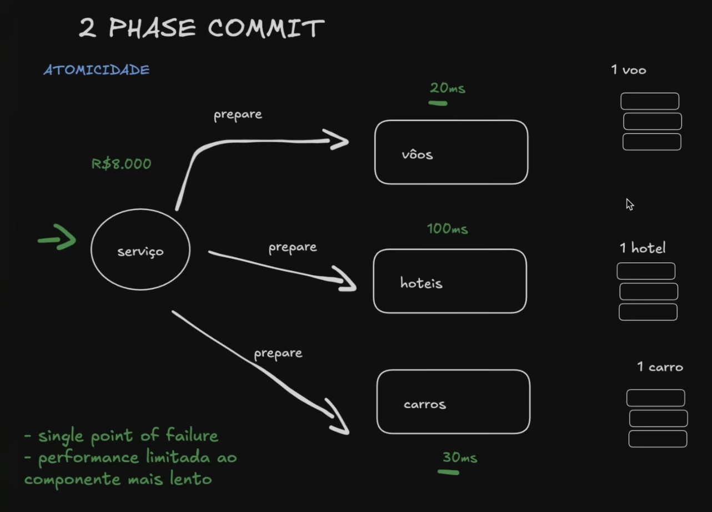
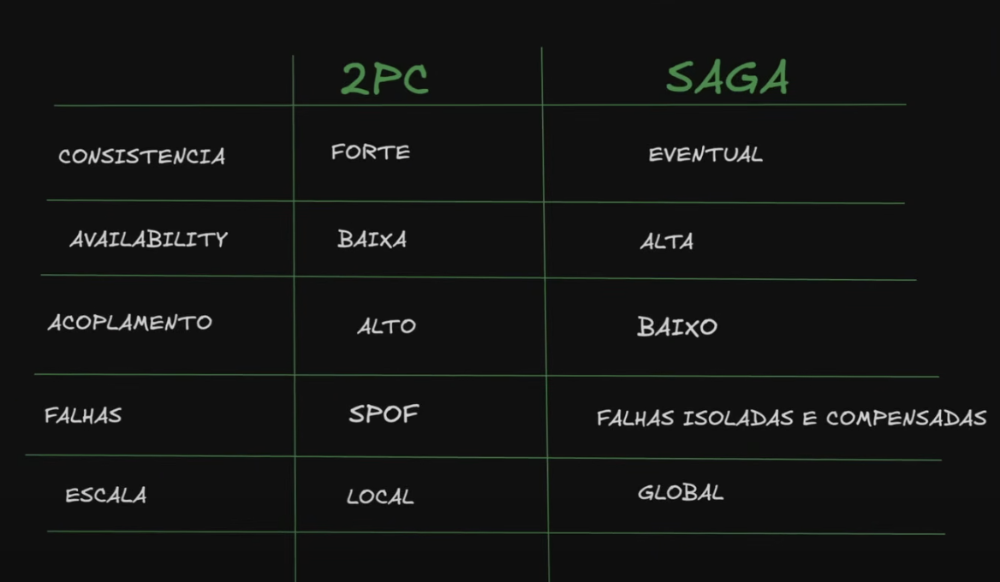

# Two-Phase Commit (2PC) – Observações

## Problema de escalabilidade
- Não escala bem com muitos serviços.
- Não é adequado em cenários globais de web.
- Se não houver controle dos serviços → pior ainda.

## Quando pode ser adequado
- Todos os serviços estão sob controle (ex.: mesmo datacenter / AWS).
- Latência conhecida e baixa (~30ms).
- Cenário pequeno/médio: ex. empresa com ~1.000 reservas/dia (≠ Booking.com).

## Vantagem nesse contexto
- Solução simples.
- Suficiente para empresas que não precisam de escala massiva.

## Comparação com [Saga Pattern](https://github.com/DeveloperArthur/algoritmos-guias-anotacoes-uteis/blob/main/saga-pattern/saga.md)

