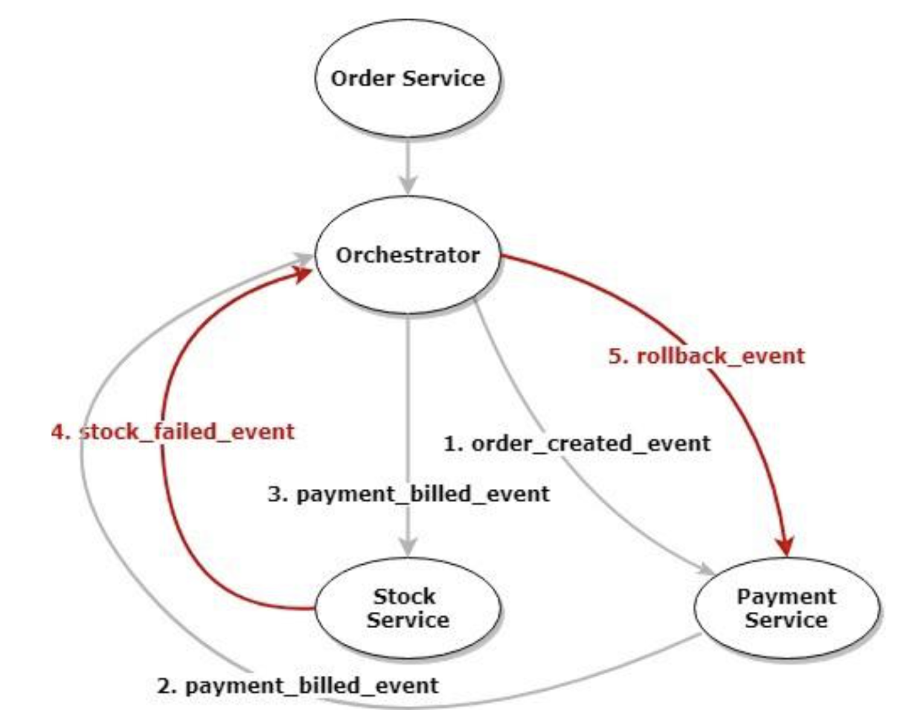

# Saga Pattern


Para entendermos o que é o Saga Pattern, primeiro precisamos entender o que são
**Transações Distribuídas**:

Transações Distribuídas são aquelas transações que iniciam em um microsserviço e finalizam em
outro, imagina um fluxo de compra com microsserviço de pedido, ele recebe a request, salva no banco
e chama o microsserviço de pagamentos, faz o pagamento, salva no banco e chama o microsserviço
de produto que atualiza o estoque...


E se der erro na hora do microsserviço de pagamento chamar o microsserviço de produto? Teremos
dados inconsistentes... Pois tanto o microsserviço de pedido como o microsserviço de pagamento já
realizaram suas ações e já salvaram nos seus bancos de dados...


Não podemos descartar esse problema, como se não fosse acontecer, isso pode acontecer e [a rede
não é confiável](https://www.linkedin.com/feed/update/urn:li:activity:7030252898076798976), e se
acontecer, vamos precisar dar rollback nas transações finalizadas quando ocorrer um erro, é aí
que o Saga Pattern entra...

O Saga Pattern vem para resolver o problema de dados inconsistentes gerados por Transações
Distribuídas

### Soluções para lidar com esse problema


- Saga Pattern orquestrado
- Saga Pattern coreografado
- Transactional Outbox
- [2 Phase Commit](https://github.com/DeveloperArthur/algoritmos-guias-anotacoes-uteis/blob/main/saga-pattern/2pc.md)

O Saga é um pattern com objetivo de garantir a execução de sucesso de um fluxo de transações, e
também garantir que em caso de falha, todas as alterações sejam desfeitas na sequência que foram
realizadas...

Esse pattern demanda muita complexidade, porém resolve um problema específico

### Orquestrado


Um microsserviço será responsável por orquestrar, o orquestrador conhece o fluxo, ele sabe a
sequência de quais microsserviços chamar, e no caso de uma falha, ele sabe para quem tem que
devolver o evento pra desfazer a alteração, se der erro no microsserviço de estoque, o
microsserviço de estoque vai devolver ERRO pro orquestrador, e o orquestrador vai mandar de volta
pros outros microsserviços pra eles desfazer as alterações que foram feitas



Os microsserviço devem ser independentes, eles não devem se conhecer, não devem saber quem é o
próximo ou o anterior

O orquestrado é recomendado quando já se tem uma arquitetura de microsserviços

**Desvantagem**: se o orquestrador cair, o fluxo todo fica fora

### Coreografado


Ao contrário do orquestrado, aqui o próprio microsserviço tem conhecimento dos próximos
microsserviço que serão executados na ordem conforme a resposta

E cada microsserviço sabe que em caso de falha, ele deve dar um rollback nele mesmo e mandar o
evento de erro de volta pro microsserviço anterior


O coreografado é recomendado para arquiteturas que ainda estão em estágio inicial de desenvolimento

**Desvantagem**: mais difícil de testar e maior complexidade de manter a lógica caso mude

## SEC (Saga Execution Controller)


Utilizando Saga Pattern vamos precisar de uma classe SEC, que é a implementação do Saga

No caso do orquestrado, essa classe vai ficar dentro do microsserviço orquestrador

No caso do coreografado, essa classe vai ficar dentro de cada microsserviço

No coreografado existe a opção também de deixar a classe em um objeto externo (um broker ou
ferramenta de gerenciamento de eventos), mas ele vai apenas redirecionar os eventos,
a lógica de próximo e anterior tem que permanecer dentro de cada microsserviço, ou seja,
o microsserviço que deve chamar o objeto externo passando quem é o próximo e o anterior, e ele
só vai fazer o redirecionamento

## Duplicidade de eventos e Idempotência


Para resolver o problema de duplicidade de eventos, é necessário implementar um mecanismo de
idempotência. Isso garante que uma mesma operação não seja processada mais de uma vez,
evitando, por exemplo, pagamentos duplicados

A solução envolve salvar as informações da transação (como produto, pagamento, etc.)
no banco de dados utilizando o ID único da transação (`transactionId`). Na regra de negócio, logo no 
início,
é realizada uma consulta (SELECT) usando esse ID recebido na requisição para verificar se
já existe um registro correspondente. Se o ID já estiver registrado, a operação é interrompida pois
trata-se de um evento duplicado, e um erro é retornado. Isso é o que caracteriza a
idempotência na operação

## Controle de rollback

### Estrutura das Tabelas

- Tabela `Estoque`: Contém informações sobre os produtos, incluindo `codigoProduto` e 
  `quantidadeDisponivel`, que representa a quantidade disponível no estoque.
- Tabela `Pedido`: Armazena informações como `novaQuantidadeDoEstoque`, `quantidadeAntigaDoEstoque`
e detalhes do pedido para controle de alterações e possíveis rollbacks

### Como funciona o rollback

Para gerenciar o estoque durante a criação e atualização de pedidos, o sistema segue as
seguintes etapas:

- Atualização do Estoque

    - Quando um pedido é criado, a quantidade disponível no estoque é armazenada como 
      `quantidadeAntigaDoEstoque`.
      Isso representa a quantidade de produtos que **estavam** disponíveis no momento em que o 
      pedido foi gerado:
        ```
        pedido.setQuantidadeAntigaDoEstoque(estoque.getQuantidadeDisponivel());

    - A nova quantidade (`novaQuantidadeDoEstoque`) é calculada subtraindo a quantidade de produtos 
      que o 
      cliente deseja comprar da quantidade disponível no estoque:
        ```
        pedido.setNovaQuantidadeDoEstoque(estoque.getQuantidadeDisponivel() - quantidadeProdutosClienteQuer);

    - A tabela de estoque é atualizada com essa nova quantidade:
        ```
        estoque.setQuantidadeDisponivel(pedido.getNovaQuantidadeDoEstoque());

- Rollback em Caso de Falha

    - Caso ocorra algum problema durante o processamento do pedido e seja necessário reverter as
      operações, é feita uma consulta na tabela `pedido` para buscar todos os pedidos associados
      ao mesmo `transactionId`
    - Para cada pedido encontrado, o sistema acessa o estoque e redefine a
      quantidade disponível para o valor antigo (`oldQuantity`) que foi armazenado antes da criação do pedido:
        ```
        var estoque = pedido.getEstoque();
        estoque.setQuantidadeDisponivel(pedido.getQuandidadeAntigaDoEstoque());

### Exemplo de Funcionamento

Quando um cliente compra dois produtos, são gerados dois registros na tabela de pedidos 
(`orderInventory`), ambos associados ao mesmo `transactionId`

Se for necessário fazer um rollback, o sistema localiza todos os registros por `transactionId` 
e restaura a quantidade disponível no estoque para o valor que estava antes do pedido ser criado 
(`oldQuantity`)

Isso garante que o Estoque retorne ao estado original caso a transação falhe

## Essa arquitetura com Saga Pattern é EDA (Event-Driven)? 
Sim, só temos uma requisição Rest para iniciar tudo, mas toda a comunicação entre os microsserviços
está sendo feita 100% através de reação, ou seja, sistemas reagindo a outros através de eventos

## Fluxo a fluxo (caso de falha)


Orquestrador:
- Orquestrador inicializa, envia evento para produto, produto retorna sucesso para 
  o orquestrador, que envia evento para microsserviço de payment
- Payment retorna sucesso para orquestrador, que envia evento para inventory
- *deu falha no inventory
- Inventory retorna ROLLBACK_PENDING para orquestrador, que envia evento de FAIL para inventory,
  inventory executa rollback e retorna FAIL para orquestrador
- Orquestrador envia evento de FAIL para payment, payment executa rollback e retorna FAIL para 
  orquestrador
- Orquestrador envia evento de FAIL para product_validation, product_validation executa rollback
  e retorna FAIL pro orquestrador
- Orquestrador vê que não tem mais nenhum microsserviço para ser chamado e finaliza a saga

## Kafka vs RabbitMQ


Kafka é desenhado para entregar de maneira distribuída, particionada e altamente escalável, e
mesmo que o RabbitMQ também possa ser escalado verticalmente, ele é mais recomendado para cargas
de trabalho com menor volume

RabbitMQ é mais simples, menos robusto do que o Kafka, Kafka é feito para aplicações de grande 
porte, grandes distribuições de streaming de dados. Para coisas pequenas, pequenas aplicações que 
não tem uma quantidade muito grande de mensagens se comunicando ou de eventos, o RabbitMQ é a 
melhor opção, muito mais leve e muito mais fácil de implementar, o Kafka é parrudo, é mais complexo

### Algumas outras diferenças:
- O Kafka possui persistência de eventos de maneira nativa e padrão, enquanto o RabbitMQ não, mesmo
podendo ser configurável através de plugins
- O Kafka possui garantia de entrega do evento por padrão, enquanto o RabbitMQ, embora também
tenha essa capacidade, não trabalha com esta abordagem por padrão